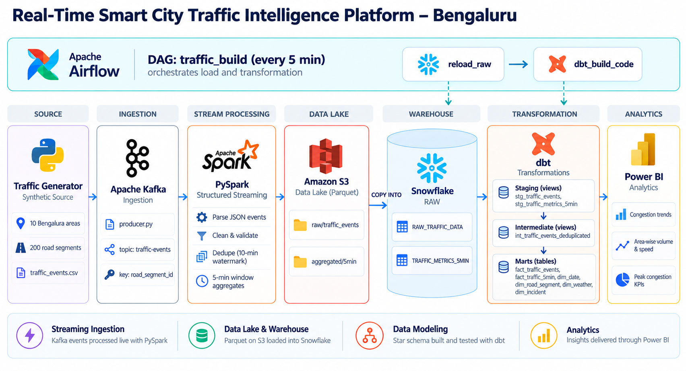
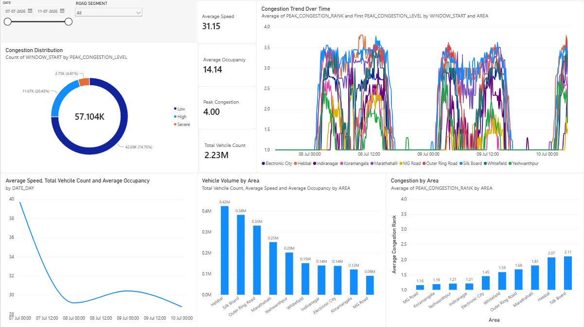
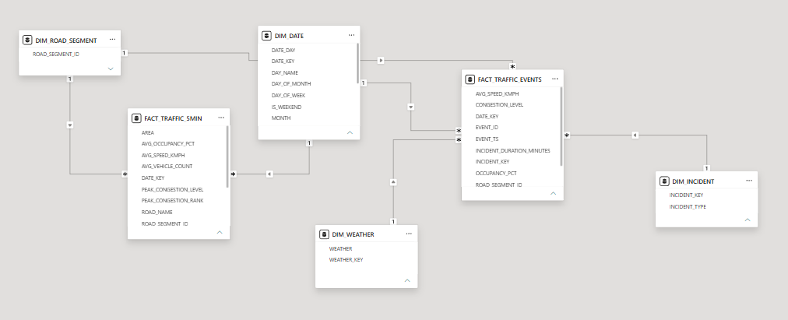

# Real-Time Smart City Traffic Intelligence Platform

An end-to-end streaming data platform for Bengaluru road traffic. Traffic events are streamed through **Kafka**, cleaned and aggregated in real time with **PySpark Structured Streaming**, landed in **Amazon S3**, loaded into **Snowflake**, modelled into a star schema with **dbt**, orchestrated by **Apache Airflow 3** (in Docker), and served to **Power BI** for reporting.

> The traffic data is **synthetic**. It comes from a statistical simulator included in this repo (`traffic_generator.py`), not from real sensors. See [docs/DATA_GENERATOR.md](docs/DATA_GENERATOR.md).

---

## Architecture

```mermaid


| Layer | Tool | What it does |
|---|---|---|
| Source | `traffic_generator.py` | Generates realistic synthetic traffic events for 10 Bengaluru areas and 200 road segments |
| Ingestion | Kafka (Confluent 7.5.3, Docker) | `producer.py` publishes each event as JSON to the `traffic-events` topic, keyed by `road_segment_id` |
| Stream processing | PySpark Structured Streaming | Parses JSON, cleans nulls and invalid values, deduplicates with a 10-minute watermark, and builds 5-minute window aggregates |
| Data lake | Amazon S3 | Two Parquet sinks: raw events and 5-minute metrics, with checkpointing |
| Warehouse | Snowflake | External stages plus `COPY INTO` load the S3 files into `RAW` and `AGGREGATED` schemas |
| Transformation | dbt (dbt-snowflake 1.12) | Staging → intermediate (dedup) → star-schema marts, plus data tests |
| Orchestration | Apache Airflow 3.1 (Docker) | DAG `traffic_build` runs every 5 minutes: `COPY INTO` → `dbt build` |
| BI | Power BI | Dashboards on top of the marts |

---

## Repository structure

```
.
├── traffic_generator.py            # synthetic traffic data generator (CLI)
├── config/                         # areas & road-segment definitions for the generator
├── schemas/traffic_event_schema.json
├── tests/                          # pytest suite for the generator
├── docker-compose.yaml             # Kafka + Zookeeper
├── Kafka/
│   ├── producer.py                 # CSV → Kafka topic
│   └── consumer.py                 # debug consumer (prints messages)
├── pyspark_transformation/
│   └── trans.py                    # Kafka → clean/aggregate → S3 (Parquet)
├── traffic/                        # dbt project
│   ├── dbt_project.yml
│   ├── macros/generate_schema_name.sql
│   ├── models/
│   │   ├── staging/                # stg_traffic_events, stg_traffic_metrics_5min, sources
│   │   ├── intermediate/           # int_traffic_events_deduplicated
│   │   └── marts/
│   │       ├── dimensions/         # dim_date, dim_road_segment, dim_weather, dim_incident
│   │       └── facts/              # fact_traffic_events, fact_traffic_5min
│   └── tests/traffic_event_ranges.sql
├── airflow/
│   ├── Dockerfile                  # Airflow 3.1 + Snowflake provider + isolated dbt venv
│   ├── docker-compose.yml          # Postgres, API server, scheduler, DAG processor, triggerer
│   ├── dags/traffic.py             # traffic_build DAG
│   ├── dbt_profiles/profiles.yml   # dbt profile, reads credentials from env vars
│   └── .env.example                # template for airflow/.env
└── docs/
    ├── DATA_GENERATOR.md           # full generator documentation
    └── images/                     # Power BI screenshots
```

---

## Data model (dbt)

```
sources (RAW.RAW_TRAFFIC_DATA, AGGREGATED.TRAFFIC_METRICS_5MIN)
   │
   ├── staging        (views)   stg_traffic_events, stg_traffic_metrics_5min
   │                            trims strings, normalises congestion levels, NULLs empty values
   ├── intermediate   (views)   int_traffic_events_deduplicated
   │                            ROW_NUMBER() over event_id keeps the latest record
   └── marts          (tables)  star schema
         dimensions:  dim_date · dim_road_segment · dim_weather · dim_incident
         facts:       fact_traffic_events (event grain) · fact_traffic_5min (5-min window grain)
```

- Each layer gets its own Snowflake schema (`staging`, `intermediate`, `marts`) through a custom `generate_schema_name` macro.
- The singular test `traffic_event_ranges` checks latitude/longitude, non-negative counts and speeds, occupancy between 0 and 100, and `hour_of_day` between 0 and 23.

---

## Power BI dashboard

The marts are loaded into Power BI as a star schema: two fact tables (`FACT_TRAFFIC_EVENTS` at event grain, `FACT_TRAFFIC_5MIN` at 5-minute window grain) share the conformed dimensions `DIM_DATE` and `DIM_ROAD_SEGMENT`, with `DIM_WEATHER` and `DIM_INCIDENT` on the event fact.



What the dashboard shows (7–11 July 2026 sample):
- **57.1K** five-minute windows, **2.23M** vehicles, average speed **31.15 km/h**, average occupancy **14.14%**
- Congestion split: **74.8% Low**, **20.4% High**, **4.8% Severe**
- Clear morning and evening peaks in the congestion trend for every area
- **Silk Board** (2.11) and **Hebbal** (2.07) have the highest average congestion rank; **MG Road** (1.16) has the lowest
- **Hebbal** carries the most traffic (0.42M vehicles), followed by Silk Board and Outer Ring Road

**Data model**



---

## Orchestration (Airflow)

DAG **`traffic_build`**, scheduled `*/5 * * * *`, with `catchup=False`:

1. **`reload_raw`** (`SQLExecuteQueryOperator`): runs `COPY INTO` from the S3 external stages into `RAW.RAW_TRAFFIC_DATA` and `AGGREGATED.TRAFFIC_METRICS_5MIN`. Snowflake's load metadata skips files it has already loaded.
2. **`dbt_build_code`** (`BashOperator`): runs `dbt build`, which covers models and tests, from a separate Python virtualenv inside the image. Keeping dbt in its own venv avoids dependency clashes with Airflow.

Docker setup notes for Airflow 3:
- `AIRFLOW__CORE__EXECUTION_API_SERVER_URL` points tasks to the API server by service name.
- A shared `AIRFLOW__API_AUTH__JWT_SECRET` lets the scheduler and API server trust each other's task tokens.
- The dbt project (`../traffic`) and `dbt_profiles/` are bind-mounted into the containers.
- dbt writes its `target/` and `logs/` to `/tmp` inside the container.

---

## Getting started

### Prerequisites
- Docker Desktop
- Python 3.12 with Java 17 (for PySpark)
- An AWS account with an S3 bucket, and AWS credentials available to Spark
- A Snowflake account with:
  - database `TRAFFIC` and schemas `RAW` and `AGGREGATED`
  - tables `RAW.RAW_TRAFFIC_DATA` and `AGGREGATED.TRAFFIC_METRICS_5MIN`
  - external stages `RAW.TRAFFIC_RAW_STAGE` (pointing at `s3://<bucket>/raw/traffic_events/`) and `AGGREGATED.TRAFFIC_AGG_STAGE` (pointing at `s3://<bucket>/aggregated/5min/`), both with a Parquet file format

### 1. Generate data
```bash
pip install -r requirements.txt
python traffic_generator.py --days 7 --output-dir output
```

### 2. Start Kafka and stream events
```bash
docker compose up -d                        # Kafka on localhost:9092
pip install confluent-kafka pyspark
python pyspark_transformation/trans.py      # start the streaming job first (reads latest offsets)
python Kafka/producer.py                    # then publish events
```
> Set `folder` in `Kafka/producer.py` and `s3_bucket` in `pyspark_transformation/trans.py` to your own paths.

### 3. Start Airflow (loads Snowflake and runs dbt)
```bash
cd airflow
cp .env.example .env                        # fill in Snowflake credentials and Airflow keys
docker compose build
docker compose up -d
```
- UI: **http://localhost:8081**
- The admin password is printed in the API server logs:
  ```powershell
  docker compose logs airflow-api-server | Select-String -Pattern "password"
  ```
- Unpause **`traffic_build`**. It then runs every 5 minutes.

### Run dbt locally (optional)
```bash
cd traffic
dbt build --profiles-dir ../airflow/dbt_profiles   # needs the SNOWFLAKE_* env vars set
```

### Run the generator tests
```bash
python -m pytest
```

---

## Tech stack

`Python` · `Apache Kafka` · `PySpark Structured Streaming` · `Amazon S3` · `Snowflake` · `dbt` · `Apache Airflow 3` · `Docker` · `PostgreSQL` · `Power BI`

## Author

**Devraj Bijpuria**, [GitHub](https://github.com/DevrajBijpuria) · [Portfolio](https://portfoliodevraj.vercel.app)
